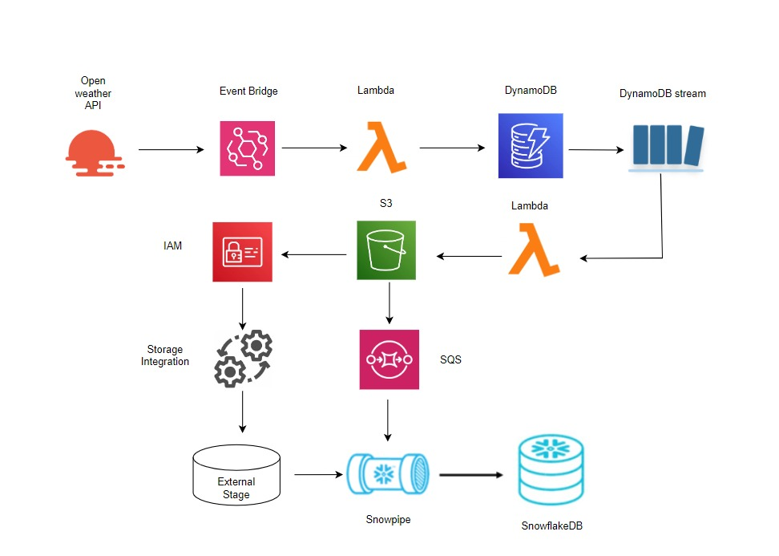
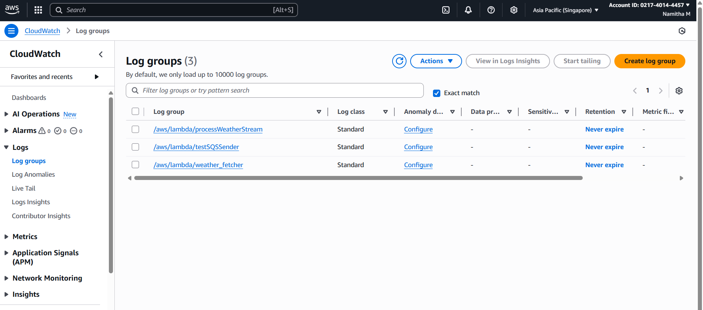
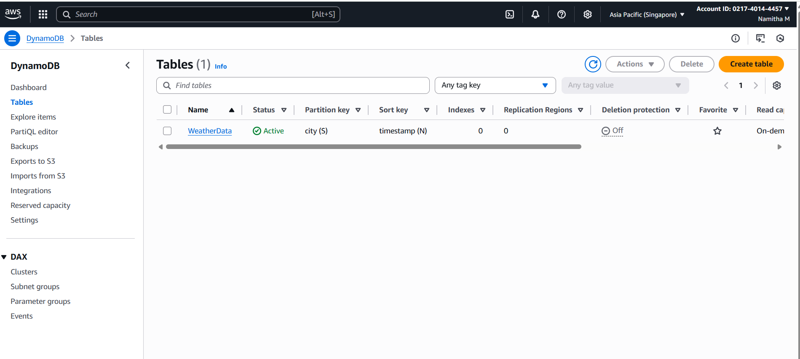
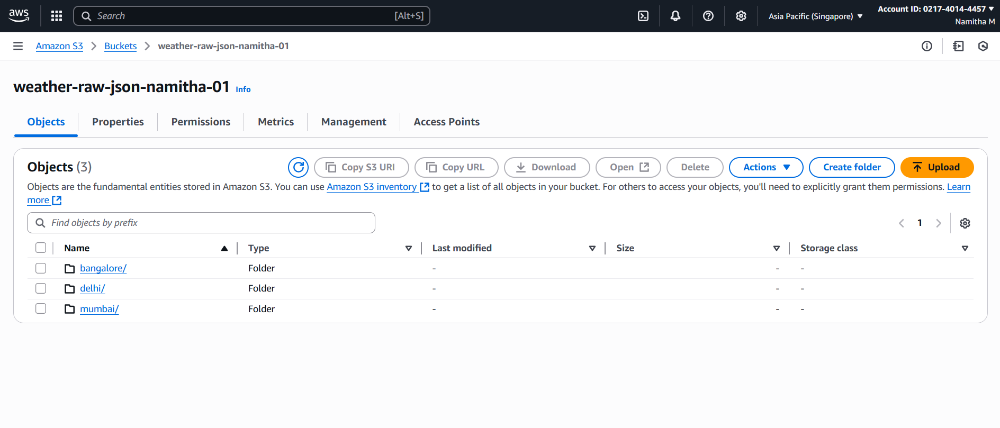
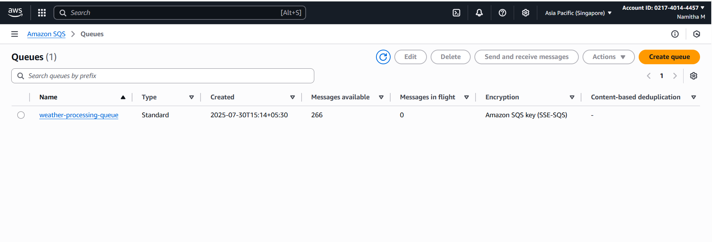
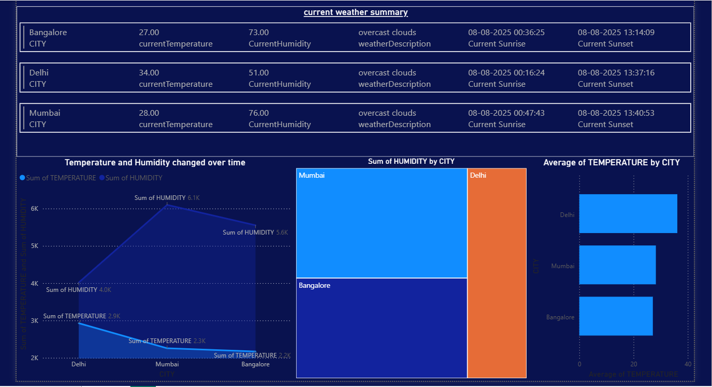
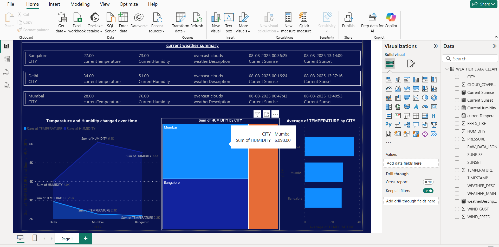

# Automated Weather Data Pipeline ☁️📊

This project implements a robust, automated data pipeline to collect, process, store, and visualize real-time weather data from the OpenWeatherMap API. The pipeline leverages a combination of AWS serverless services and Snowflake for efficient data warehousing, culminating in an interactive Power BI dashboard for analysis.

The pipeline is designed for continuous data flow, from API ingestion to a ready-for-analysis format.

## Data Flow:

###### 1.	Lambda Function 1 – Weather Fetcher  
o	Triggered by Amazon EventBridge (CloudWatch scheduled rule).  
o	Fetches weather data for Bangalore, Delhi, and Mumbai.  
o	Saves data in DynamoDB.  

##### 2.	DynamoDB Stream → ProcessweatherStream  
o	Triggered by DynamoDB stream events.  
o	Converts DynamoDB JSON to normal JSON.  
o	Uploads raw JSON to S3 (bucket: weather-raw-json-namitha-01).  
o	Sends the same data to an SQS queue (weather-processing-queue).  
##### 3.	Snowflake Integration  
o	S3 bucket connected to Snowflake via External Stage and Storage Integration (S3_INT_WEATHER_SGP).  
o	Snowpipe (weather_pipe_sgp) auto-loads new files into RAW_JSON_SCHEMA.weather_raw_data.  
##### 4.	Data Transformation in Snowflake    
o	Raw JSON parsed into a structured table (weather_data_clean) containing:  
	City, timestamp, temperature, humidity, pressure, wind data, weather conditions, sunrise/sunset times.
o	Stream (weather_data_stream) detects new inserts.
o	Task (insert_clean_data) runs every 5 minutes to append cleaned data.

## ✨ Features
Automated Data Ingestion: Seamlessly collects real-time weather data from OpenWeatherMap API.

Serverless Architecture: Utilizes AWS Lambda, DynamoDB, S3, and SQS for scalable and cost-effective operations.

Continuous Data Loading: Employs Snowflake Snowpipe for automatic, near real-time ingestion from S3.

Data Transformation & Cleansing: Transforms raw JSON into a structured, queryable format within Snowflake.

Scheduled Processing: Snowflake Streams and Tasks automate the movement of data from raw to clean layers.

Interactive Visualization: Provides a dynamic Power BI dashboard for current weather conditions and historical trends.

Version Control: All code and configurations are managed in GitHub for traceability and collaboration.

## 🛠️ Technologies Used

Cloud Platform: Amazon Web Services (AWS)

Compute: AWS Lambda

Scheduling: AWS EventBridge  
  
Database (NoSQL): Amazon DynamoDB
  
Storage: Amazon S3
  
Messaging: Amazon SQS
  
Identity & Access Management: AWS IAM

Data Warehouse: Snowflake

Ingestion: Snowpipe

Change Data Capture: Streams

Automation: Tasks

Programming Language: Python

Libraries: boto3, requests, decimal

Business Intelligence: Microsoft Power BI

Version Control: Git / GitHub

## 📂 Project Structure

your-weather-data-pipeline/  
├──  lambda_code/  
│   ├── weather_fetcher.py        
│   ├── processweatherstream.py         
│   └── requirements.txt           
├── snowflake_sql/  
│   ├── snowflake_initial_setup.sql              
│   ├── snowflake_database_schema_stage.sql      
│   ├── snowflake_raw_data_table_pipe.sql         
│   ├── snowflake_clean_data_table_stream_task.sql   
│   └── snowflake_utility_queries.sql             
└──  README.md                      

## ⚙️ Setup and Deployment
This section outlines the high-level steps to deploy the weather data pipeline. Ensure you have appropriate AWS and Snowflake permissions before proceeding.

##### 1. AWS Setup
   
OpenWeatherMap API Key: Obtain a free API key from OpenWeatherMap.

DynamoDB Table: Create a DynamoDB table named WeatherData with city as the Partition Key and timestamp as the Sort Key. Enable DynamoDB Streams (New and Old Images).

S3 Bucket: Create an S3 bucket (e.g., weather-raw-json-namitha-01) for storing raw JSON data.

SQS Queue: Create a Standard SQS queue (e.g., weather-processing-queue) that Snowpipe will listen to.

IAM Roles:

Create an IAM role for your Lambda functions with permissions to access DynamoDB, S3, SQS, and CloudWatch Logs.

Create an IAM role ( SnowflakeS3AceessRole01) for Snowflake to access your S3 bucket, with s3:GetObject and s3:ListBucket permissions.

weather_fetcher (Ingestion):

Create a Python 3.9+ Lambda function.

Copy the code from lambda_code/lambda_function1.py.

Set environment variables for API_KEY.

Configure an EventBridge rule to trigger this Lambda on a schedule (e.g., every 5 minutes).

Lambda Function 2 (Processing):

Create a Python 3.9+ Lambda function.

Copy the code from lambda_code/lambda_function2.py.

Configure this Lambda to be triggered by the DynamoDB Stream of your WeatherData table.

S3 Event Notification: In your S3 bucket's Properties tab, configure an event notification for "All object create events" (s3:ObjectCreated:*) to send messages to the SQS queue used by Snowpipe.

##### 2. Snowflake Setup
   
Execute the SQL scripts located in the snowflake_sql/ directory in the following order:

snowflake_initial_setup.sql: Run this first to get your current region, account, and set up the storage integration with AWS. Note the STORAGE_AWS_EXTERNAL_ID and STORAGE_AWS_IAM_USER_ARN from DESC INTEGRATION s3_int_weather_sgp; output, as you'll need these for your AWS IAM role's trust policy.

snowflake_database_schema_stage.sql: Creates the database, schema, and external stage.

snowflake_raw_data_table_pipe.sql: Defines the raw data table and the Snowpipe for automated ingestion.

snowflake_clean_data_table_stream_task.sql: Sets up the clean data table, the stream to track changes, and the automated task to populate the clean table. Ensure the WAREHOUSE name matches your Snowflake warehouse.

Activate the Pipe and Task: Ensure both the Snowpipe and the Snowflake task are active.

ALTER PIPE weather_pipe_sgp SET PIPE_EXECUTION_PAUSED = FALSE;
ALTER TASK insert_clean_data RESUME;

Manual Pipe Refresh (Optional): If you had existing files in S3 before the pipe was fully configured, you can manually refresh the pipe to ingest them:

ALTER PIPE weather_pipe_sgp REFRESH;

snowflake_utility_queries.sql: Use these queries to verify data flow and check component statuses.

##### 3. Power BI Setup

Download Power BI Desktop: If you don't have it, download and install Power BI Desktop.

Open Report: Open the power_bi/weather_data.pbix file.

Connect to Snowflake: You will be prompted to enter your Snowflake connection details. Provide your server, warehouse, and credentials.

Refresh Data: Once connected, click the "Refresh" button on the Home tab to pull the latest data from Snowflake.

Publish to Power BI Service: To enable scheduled refreshes and sharing, publish your report to the Power BI Service (requires a work/school email address and a Power BI Pro/Premium license). Configure a data gateway if your Snowflake instance is not publicly accessible.

Scheduled Refresh: In Power BI Service, set up a scheduled refresh for your dataset to automatically update your dashboard at desired intervals.

📊 Dashboard Features

•	Current Weather Summary: Shows live temperature, humidity, weather conditions, sunrise, and sunset for each city.
•	Temperature & Humidity Trend Line: Displays changes over time.
•	City-wise Tree Map: Shows total humidity by city.
•	Average Temperature Bar Chart: Compares city temperatures side-by-side.
•	Filter Capabilities: Allow viewing specific cities or time ranges.

## 📸 Screenshots

💻 Usage

Once the pipeline is fully operational and your Power BI dashboard is published:

The dashboard will automatically update with the latest weather data for Bangalore, Delhi, and Mumbai.

Interact with the visuals to explore current conditions, trends, and comparisons between cities.

Leverage the DAX measures to understand specific metrics like "Latest Temperature," "Current Sunrise," and "Current Sunset."

## Future Enhancements

Expand City Coverage: Add more cities to the CITIES list in your Lambda function.

Historical Data Analysis: Build out more robust historical trend analysis and comparisons in Power BI.

Alerting: Implement anomaly detection and notification systems for significant weather changes.

Forecasting: Integrate predictive models for future weather conditions.

Comprehensive Error Handling: Enhance logging and monitoring across all AWS and Snowflake components.

Cost Optimization: Further fine-tune resource allocation and scheduling.
